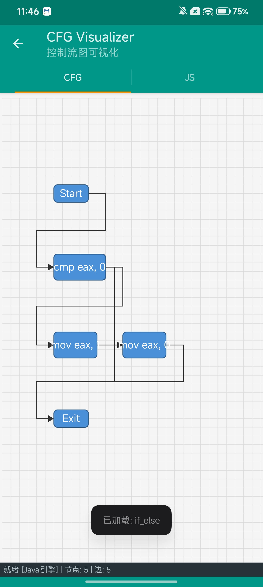
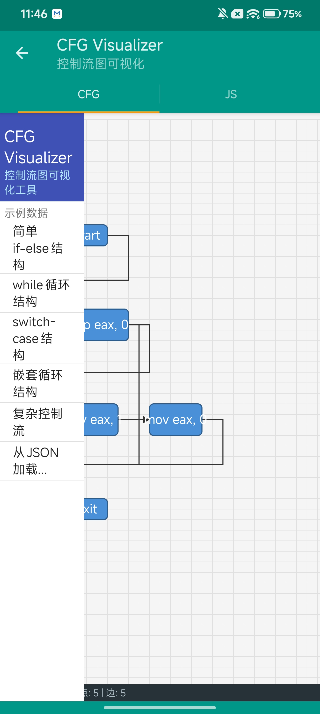
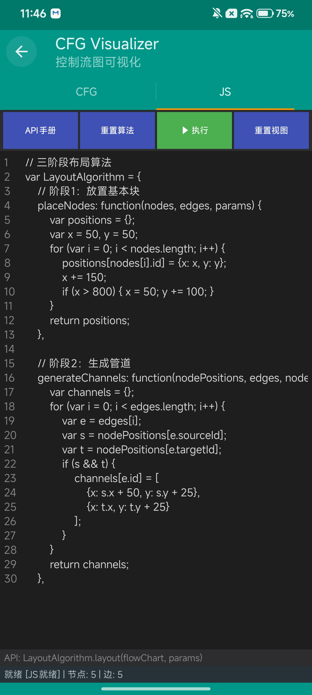

# 流程图设计（CFG Visualizer）

> Android 端控制流图（Control Flow Graph）可视化与布局设计工具，支持 JavaScript 编写自定义布局算法。

---

## 一、项目简介

本项目是一个 Android 应用，名称为 **CFG Visualizer（控制流图可视化工具）**，用于在移动端加载、渲染并自动布局控制流图（CFG）。应用支持通过 JSON 描述 CFG 数据，并通过可编辑的 JavaScript 脚本来执行三阶段布局算法（节点放置 → 管道生成 → A* 寻路），最终将图结构渲染到自定义 View 上。

**核心特性：**
- 📊 纯 Java 自定义 Canvas 绘制流程图
- 🧩 基于 WebView + JavaScript 的可扩展布局引擎
- 📝 内置 JS 代码编辑器，可实时修改/执行布局算法
- 📂 内置 5 个示例 CFG（if-else、while、switch-case、嵌套循环、复杂流程）
- 📥 支持手动粘贴 JSON 加载自定义 CFG
- 📱 提供侧滑栏导航 + ActionBar Tab 切换视图
- 🛡️ 全局异常捕获与崩溃日志记录

---

## 二、目录结构

```
流程图设计/
├── build.gradle                    # 根项目 Gradle 配置（AGP 7.0.2）
├── settings.gradle                 # 模块声明
├── gradle.properties
├── gradlew / gradlew.bat           # Gradle Wrapper
├── local.properties
├── .gitignore
└── app/
    ├── build.gradle                # App 模块配置
    ├── proguard-rules.pro
    └── src/main/
        ├── AndroidManifest.xml
        ├── java/com/flowchart/editor/
        │   ├── MainActivity.java           # 主界面（入口）
        │   ├── GlobalApplication.java      # Application + 全局异常处理
        │   ├── engine/
        │   │   └── JSEngine.java           # JS 引擎（WebView 桥接）
        │   ├── model/
        │   │   ├── FlowChart.java          # 流程图数据模型
        │   │   ├── Node.java               # 节点模型
        │   │   ├── Edge.java               # 边模型
        │   │   ├── Port.java               # 端口模型
        │   │   ├── Point.java              # 坐标点模型
        │   │   └── LayoutResult.java       # 布局结果模型
        │   └── view/
        │       └── FlowChartView.java      # 自定义绘图 View
        ├── res/
        │   ├── layout/activity_main.xml   # （空容器，UI 全部由代码构建）
        │   ├── values/strings.xml          # app_name = 流程图设计
        │   ├── values/colors.xml
        │   ├── values/styles.xml
        │   ├── values-v21/styles.xml
        │   └── drawable/ic_launcher.png
        └── assets/
            ├── cfg/                       # 示例 CFG JSON
            │   ├── if_else.json
            │   ├── while_loop.json
            │   ├── switch_case.json
            │   ├── nested_loop.json
            │   └── complex.json
            └── js/                        # JS 布局算法
                ├── default_algorithm.js
                └── hierarchical_algorithm.js
```

---

## 三、构建与运行

### 1. 环境要求
- Android Gradle Plugin：**7.0.2**
- compileSdkVersion：**33**
- minSdkVersion：**19**（Android 4.4+）
- targetSdkVersion：**26**
- buildToolsVersion：**33.0.0**
- JDK：1.8+（代码中使用了 `org.json`）

### 2. 构建命令
```bash
./gradlew assembleDebug      # 构建 Debug APK
./gradlew assembleRelease    # 构建 Release APK
```

构建产物路径：`app/build/bin/`（项目内已包含历史编译产物 `classesdebug` 与 `classesrelease`）。

### 3. 运行
将 Debug APK 安装到 Android 设备后启动 **流程图设计** 应用即可。

---

## 四、核心模块详解

### 4.1 MainActivity（[MainActivity.java](file:///workspace/远程仓库/流程图设计/app/src/main/java/com/flowchart/editor/MainActivity.java)）

主 Activity，**纯 Java 构建 UI**，不依赖 XML 布局。

- **ActionBar Tabs**：`CFG`（可视化视图）和 `JS`（代码编辑器）两个标签页。
- **侧滑栏 Drawer**：通过点击 Home/菜单按钮弹出，包含 6 个示例入口（前 5 个加载内置 CFG，最后一个打开 JSON 输入对话框）。
- **状态栏**：底部黑色横条，显示 `就绪 | 节点数 | 边数`。
- **核心方法**：
  - `initJSEngine()`：延迟 500ms 初始化 WebView 与 JSEngine。
  - `loadExampleCFG(name)`：从 assets/cfg/ 加载示例 JSON。
  - `loadCFGFromJSON(json)`：解析 JSON 并刷新视图，引擎就绪后自动执行布局。
  - `executeAlgorithm()`：将编辑器内的 JS 代码送入引擎执行。
  - `JSEngineCallback` 回调：`onEngineReady`、`onEngineError(String)`、`onResult(LayoutResult)`。

### 4.2 JSEngine（[JSEngine.java](file:///workspace/远程仓库/流程图设计/app/src/main/java/com/flowchart/editor/engine/JSEngine.java)）

基于 `WebView + JavaScript Interface` 的 JS 执行引擎。

- **`buildEngineHTML()`**：在 WebView 中注入内嵌的 `FlowChartLayout` 默认算法对象。
- **`executeLayout(flowChart, customCode)`**：
  - 将 `flowChart` 序列化为 JSON 字符串嵌入脚本。
  - 若提供了用户自定义代码，则用 `new Function(...)` 包装执行。
  - 通过 `evaluateJavascript`（API 19+）调用，回调通过 `JSEngine.onResult` / `JSEngine.onError` 回到 Java 层。
- **`JSInterface`**：暴露给 JS 调用的桥接接口。

### 4.3 数据模型（`com.flowchart.editor.model`）

| 类名 | 职责 |
| --- | --- |
| [FlowChart](file:///workspace/远程仓库/流程图设计/app/src/main/java/com/flowchart/editor/model/FlowChart.java) | 流程图容器，包含节点、边、端口三个列表，并维护 id→Node/Edge 的 HashMap 索引。提供 `toJSON/fromJSON` 与 `applyLayoutResult` |
| [Node](file:///workspace/远程仓库/流程图设计/app/src/main/java/com/flowchart/editor/model/Node.java) | 节点（基本块），属性：id、label、width、height、x、y、type（normal/entry/exit 等） |
| [Edge](file:///workspace/远程仓库/流程图设计/app/src/main/java/com/flowchart/editor/model/Edge.java) | 有向边，属性：id、sourceId、targetId、label（如 `je/jne`）、path（折线控制点） |
| [Port](file:///workspace/远程仓库/流程图设计/app/src/main/java/com/flowchart/流程图设计/app/src/main/java/com/flowchart/editor/model/Port.java) | 端口，4 个方位常量（LEFT/TOP/RIGHT/BOTTOM），提供 `getRelativeX/Y` 计算 |
| [Point](file:///workspace/远程仓库/流程图设计/app/src/main/java/com/flowchart/editor/model/Point.java) | 坐标点（x, y），可序列化 |
| [LayoutResult](file:///workspace/远程仓库/流程图设计/app/src/main/java/com/flowchart/editor/model/LayoutResult.java) | 布局结果：`nodePositions: Map<id, NodePosition>`、`edgePaths: Map<id, List<Point>>`、canvasWidth/Height |

### 4.4 FlowChartView（[FlowChartView.java](file:///workspace/远程仓库/流程图设计/app/src/main/java/com/flowchart/editor/view/FlowChartView.java)）

自定义 `View`，负责 CFG 的最终绘制与交互。

- **画笔**：节点填充/描边/文本、边、箭头、网格 5 类 Paint。
- **`onDraw(Canvas)`**：先 `translate + scale` 应用视口变换，依次绘制网格 → 边 → 节点。
- **`drawNodes`**：圆角矩形 + 居中文本。
- **`drawEdges`**：折线 `Path` + 末端箭头三角形（角度由 atan2 计算）。
- **`fitToView()`**：计算所有节点包围盒，按比例缩放并居中。
- **`onTouchEvent`**：支持单指拖动平移。
- **`resetView()`**：缩放/偏移归零。

### 4.5 GlobalApplication（[GlobalApplication.java](file:///workspace/远程仓库/流程图设计/app/src/main/java/com/flowchart/editor/GlobalApplication.java)）

`Application` 入口，并内嵌 `CrashHandler`。

- **`CrashHandler`**：注册全局 `UncaughtExceptionHandler`，捕获未处理异常后写入外部缓存 `crash/crash_yyyy_MM_dd-HH_mm_ss.txt`，并启动 `CrashActivity` 显示日志（提供复制到剪贴板与重启 App 能力）。
- **`PartCrashHandler`**：通过 `Looper.loop()` 捕获主线程消息循环异常，弹 Toast 提示。
- 同时提供 `write/closeIO/toString` 等静态 IO 工具方法。

---

## 五、JS 布局算法

布局算法以 JS 对象 `LayoutAlgorithm` 形式编写，必须实现 `layout(flowChart, params)` 方法，返回：

```js
{
  nodePositions: { "nodeId": {x, y}, ... },
  edgePaths:     { "edgeId": [{x,y}, {x,y}, ...], ... },
  canvasWidth:   Number,
  canvasHeight:  Number
}
```

### 5.1 三阶段流水线

| 阶段 | 方法 | 作用 |
| --- | --- | --- |
| 1 | `placeNodes(nodes, edges, params)` | 放置所有节点，返回 `{id: {x, y}}` |
| 2 | `generateChannels(nodePositions, edges, nodes, params)` | 为每条边生成管道控制点（中间路径） |
| 3 | `routeEdges(nodePositions, channels, nodes, params)` | 在管道约束下做 A* 寻路，得到实际折线 |

### 5.2 内置算法

#### [default_algorithm.js](file:///workspace/远程仓库/流程图设计/app/src/main/assets/js/default_algorithm.js)
- **节点放置**：拓扑排序（基于入度的循环松弛）→ 按层级水平铺开，对齐到 gridSize。
- **管道生成**：根据源/目标方位（上/下/左/右）选取连接点，构造三段正交折线。
- **寻路**：在管道途经点之间做简化 A*（默认退化为正交直连）。

#### [hierarchical_algorithm.js](file:///workspace/远程仓库/流程图设计/app/src/main/assets/js/hierarchical_algorithm.js)
- 借鉴 IDA Pro 风格的分层布局。
- `assignLevels` 使用 DFS 分配层级，能识别并打破环。
- `orderNodesInLevels` 在层内按前驱数量启发式排序以减少交叉。
- `findPath` 加入障碍物检测，支持单方向正交尝试。

### 5.3 自定义算法

在 JS 编辑器标签页中修改代码后点击 **▶ 执行**，新算法会通过 `executeCustom` 注入到引擎中。常用参数：

```js
{
  nodeSpacing: 50,    // 节点间距
  gridSize:    10,    // 网格吸附粒度
  maxWidth:    1200,  // 单行最大宽度（自动换行）
  levelHeight: 120,   // 分层算法层高
  channelWidth: 20    // 管道间距
}
```

---

## 六、CFG 数据格式

JSON 描述示例（`assets/cfg/if_else.json`）：

```json
{
  "id": "cfg_if_else",
  "name": "If-Else Structure",
  "nodes": [
    {"id": "start",       "label": "Start",         "width": 80,  "height": 40, "type": "entry"},
    {"id": "cmp",         "label": "cmp eax, 0",    "width": 120, "height": 60},
    {"id": "then_block",  "label": "mov eax, 1",    "width": 100, "height": 60},
    {"id": "else_block",  "label": "mov eax, 0",    "width": 100, "height": 60},
    {"id": "exit",        "label": "Exit",          "width": 80,  "height": 40, "type": "exit"}
  ],
  "edges": [
    {"id": "e1", "sourceId": "start",      "targetId": "cmp"},
    {"id": "e2", "sourceId": "cmp",        "targetId": "then_block", "label": "je"},
    {"id": "e3", "sourceId": "cmp",        "targetId": "else_block", "label": "jne"},
    {"id": "e4", "sourceId": "then_block", "targetId": "exit"},
    {"id": "e5", "sourceId": "else_block", "targetId": "exit"}
  ]
}
```

| 字段 | 必填 | 说明 |
| --- | --- | --- |
| `nodes[].id` | ✅ | 节点唯一 ID |
| `nodes[].label` | ❌ | 显示文本，默认等于 id |
| `nodes[].width/height` | ❌ | 默认 100/60 |
| `nodes[].type` | ❌ | `entry` / `exit` / `normal` 等自定义类型 |
| `edges[].sourceId/targetId` | ✅ | 引用节点 id |
| `edges[].label` | ❌ | 边标签（如 `je`、`jne`），绘制时随 path 一起显示 |

### 内置示例对照

| 文件 | 节点数 | 边数 | 场景 |
| --- | --- | --- | --- |
| if_else.json | 5 | 5 | 简单 if-else 分支 |
| while_loop.json | 4 | 4 | while 循环（带回边） |
| switch_case.json | 6 | 7 | switch-case 多分支 |
| nested_loop.json | 6 | 7 | 嵌套 for 循环 |
| complex.json | 7 | 8 | 综合控制流 |

---

## 七、应用运行流程

```
启动 App
   │
   ▼
MainActivity.onCreate
   │
   ├── createRootLayout()    // 纯代码构建 FrameLayout/侧滑栏/状态栏
   ├── setupActionBar()      // 添加 CFG / JS 两个 Tab
   ├── initData()            // 默认加载 if_else 示例
   └── initJSEngine() (500ms 延迟)
            │
            ▼
         JSEngine.init(webView)  → 加载内嵌 HTML → 回调 onEngineReady
                                          │
                                          ▼
                                    onResult(LayoutResult)
                                          │
                                          ▼
                                FlowChartView.setLayoutResult
                                          │
                                          ▼
                                  自动 fitToView 居中显示
```

用户可通过 Tab 切换到 **JS** 页修改算法，点击 **▶ 执行** 后引擎重新计算并切回 **CFG** 页查看结果。

---

## 八、真机实测截图

以下截图来自 Android 真机实际运行，展示了应用的三个核心界面。

### 8.1 CFG 可视化视图 — if-else 控制流图

加载内置示例 `if_else` 后的 CFG 可视化效果。5 个节点（Start → cmp eax, 0 → mov eax, 1 / mov eax, 0 → Exit）通过带箭头的正交折线连接，底部状态栏显示 `就绪 | 节点: 5 | 边: 5`。



### 8.2 侧滑栏导航 — 示例数据选择

点击左上角菜单按钮弹出侧滑栏，列出 6 个预设示例（简单 if-else、while 循环、switch-case、嵌套循环、复杂控制流）以及自定义 JSON 加载入口。当前已选中"简单if-else结构"。



### 8.3 JS 算法编辑器 — 自定义布局代码

切换到 **JS** 标签页后进入深色主题代码编辑器，显示当前布局算法的 JavaScript 源码。顶部工具栏提供 **API手册**、**重置算法**、**▶ 执行**（绿色高亮）、**重置视图** 四个操作按钮，底部显示 `API: LayoutAlgorithm.layout(flowChart, params)` 提示及引擎就绪状态。



---

## 九、关键文件链接

### Java 源码
- [MainActivity.java](file:///workspace/远程仓库/流程图设计/app/src/main/java/com/flowchart/editor/MainActivity.java)
- [JSEngine.java](file:///workspace/远程仓库/流程图设计/app/src/main/java/com/flowchart/editor/engine/JSEngine.java)
- [FlowChartView.java](file:///workspace/远程仓库/流程图设计/app/src/main/java/com/flowchart/editor/view/FlowChartView.java)
- [FlowChart.java](file:///workspace/远程仓库/流程图设计/app/src/main/java/com/flowchart/editor/model/FlowChart.java)
- [Node.java](file:///workspace/远程仓库/流程图设计/app/src/main/java/com/flowchart/editor/model/Node.java)
- [Edge.java](file:///workspace/远程仓库/流程图设计/app/src/main/java/com/flowchart/editor/model/Edge.java)
- [Port.java](file:///workspace/远程仓库/流程图设计/app/src/main/java/com/flowchart/editor/model/Port.java)
- [Point.java](file:///workspace/远程仓库/流程图设计/app/src/main/java/com/flowchart/editor/model/Point.java)
- [LayoutResult.java](file:///workspace/远程仓库/流程图设计/app/src/main/java/com/flowchart/editor/model/LayoutResult.java)
- [GlobalApplication.java](file:///workspace/远程仓库/流程图设计/app/src/main/java/com/flowchart/editor/GlobalApplication.java)

### Gradle 与清单
- [build.gradle（根）](file:///workspace/远程仓库/流程图设计/build.gradle)
- [app/build.gradle](file:///workspace/远程仓库/流程图设计/app/build.gradle)
- [settings.gradle](file:///workspace/远程仓库/流程图设计/settings.gradle)
- [AndroidManifest.xml](file:///workspace/远程仓库/流程图设计/app/src/main/AndroidManifest.xml)

### 资源与示例
- [default_algorithm.js](file:///workspace/远程仓库/流程图设计/app/src/main/assets/js/default_algorithm.js)
- [hierarchical_algorithm.js](file:///workspace/远程仓库/流程图设计/app/src/main/assets/js/hierarchical_algorithm.js)
- [if_else.json](file:///workspace/远程仓库/流程图设计/app/src/main/assets/cfg/if_else.json)
- [while_loop.json](file:///workspace/远程仓库/流程图设计/app/src/main/assets/cfg/while_loop.json)
- [switch_case.json](file:///workspace/远程仓库/流程图设计/app/src/main/assets/cfg/switch_case.json)
- [nested_loop.json](file:///workspace/远程仓库/流程图设计/app/src/main/assets/cfg/nested_loop.json)
- [complex.json](file:///workspace/远程仓库/流程图设计/app/src/main/assets/cfg/complex.json)
- [strings.xml](file:///workspace/远程仓库/流程图设计/app/src/main/res/values/strings.xml)

---

## 十、扩展方向建议

1. **节点编辑**：当前只能加载 JSON，可在 `FlowChartView` 上增加长按/双击弹出属性编辑对话框。
2. **导出能力**：增加导出 PNG/SVG/Mermaid 文本格式。
3. **撤销/重做**：引入 `Command` 模式记录编辑历史。
4. **多布局算法切换 UI**：将 `assets/js/*.js` 暴露为下拉选项，便于对比不同布局效果。
5. **性能优化**：节点数量大时将 A* 寻路从 JS 移至 Java NDK 或使用 Web Worker。
6. **辅助功能**：缩放控件（当前仅有平移）、节点搜索、边高亮等。
